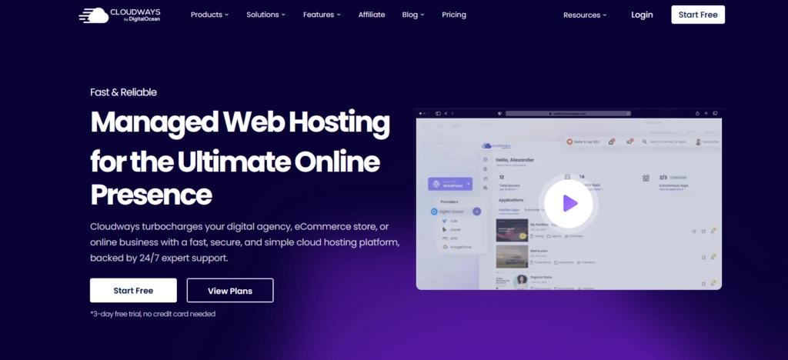
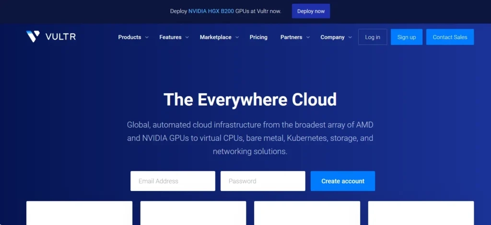
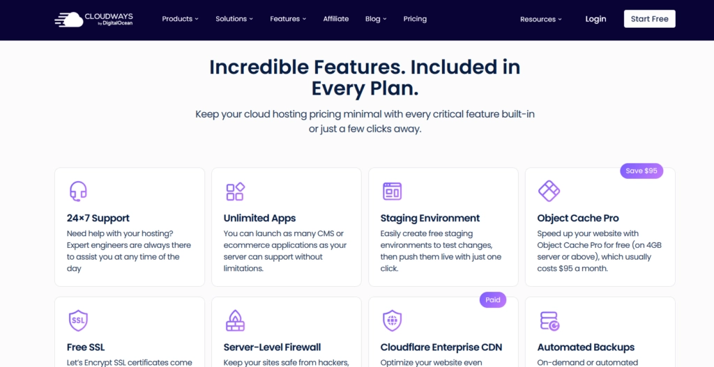
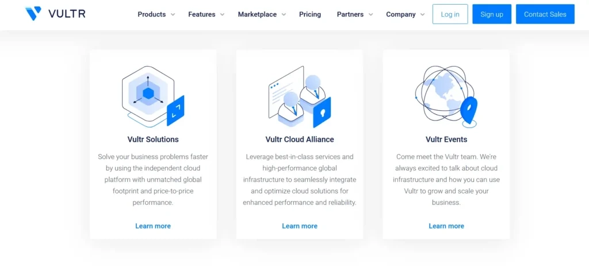
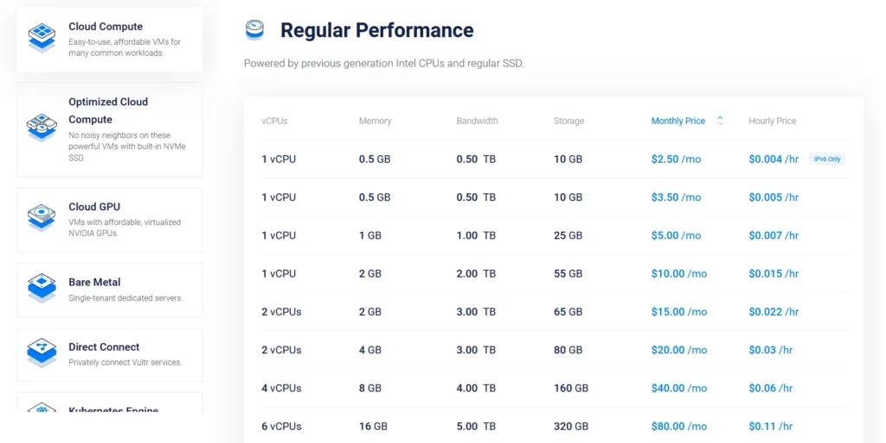

# Cloudways vs Vultr：2025年哪个云服务商更值得选？

---

如果你正在寻找一个靠谱的云服务器，却在Cloudways和Vultr之间纠结——相信我，你不是一个人。我当年也是这么过来的，看着各种参数和功能介绍，头都大了。

今天就来聊聊这两家的真实体验。不吹不黑，就说人话：哪个更适合你的项目，哪个性价比更高，以及——最重要的——哪个用起来不糟心。

---

## 先认识一下这两位选手

### Cloudways：托管云主机里的"保姆级"选手

Cloudways成立于2012年，总部在马耳他。它不是自己搞机房，而是帮你管理其他家的云服务器——比如AWS、Google Cloud、DigitalOcean这些。

说白了就是：你租了别人家的服务器，Cloudways帮你打理好一切技术活儿。装系统、做备份、打安全补丁……你只管用就行了。

这种"托管"模式特别适合那些：
- 不想折腾技术细节的创业者
- 需要专注做产品的小团队
- 或者像我一样，对Linux命令行过敏的人

Cloudways支持一键部署WordPress、Magento、Joomla这些常用应用。而且它的后台界面做得挺人性化，不会让你看着一堆英文术语发懵。

### Vultr：开发者的自由游乐场

Vultr是纯粹的基础设施供应商（IaaS）。它在全球32个数据中心提供各种规格的云服务器，从便宜的共享实例到昂贵的独立物理机都有。

最近几年Vultr发展很猛——2024年12月刚拿到AMD领投的3.33亿美元融资，估值35亿美元。这笔钱主要用来扩展AI云服务，添置更多GPU服务器。

Vultr的特点是：
- 给你一台"裸机"，爱怎么折腾就怎么折腾
- 全球节点多，想部署在哪就在哪
- 价格透明，按小时计费，用多少付多少

但相应的，所有技术活儿都得你自己搞定。装系统、配环境、做安全加固……全是你的活儿。如果你是那种喜欢DIY、追求完全控制权的技术玩家，Vultr简直是天堂。想要更灵活的云基础设施方案？👉 [Vultr全球节点任你挑，性能强悍还便宜](https://www.vultr.com/?ref=9738262-9J)，特别适合需要自定义环境的开发团队。

## 功能对比：各有各的绝活

### Cloudways能帮你做什么

**多云选择**：你可以在AWS、Google Cloud、DigitalOcean、Linode和Vultr之间挑一个底层服务商。Cloudways在中间帮你管理，你不用直接跟那些复杂的云平台打交道。

**性能优化栈（ThunderStack）**：这是Cloudways自己调教的技术栈，包括Nginx、Apache、Varnish、Memcached、Redis和PHP-FPM。说人话就是——它帮你把服务器调到最佳状态，你的网站自然跑得快。

**内置缓存机制**：Varnish、Memcached、Redis这些缓存工具都配好了。对于WordPress这种动态网站来说，缓存能让页面加载速度提升好几倍。

**安全防护**：自带防火墙、两步验证（2FA）、Web应用防火墙（WAF）。基本的安全防护都帮你做好了，省得你自己配iptables或者fail2ban这些东西。

**团队协作**：可以给团队成员分配不同权限。比如你可以让开发只能部署代码，让运维管理服务器，老板只能看报表。这对多人协作特别有用。

**一键部署**：WordPress、WooCommerce、Laravel这些常用应用都能一键安装。不用你手动下载、解压、配置数据库……点几下就搞定。

**自动备份**：系统会定期给你做备份。万一哪天不小心把数据库删了（别笑，这种事常有），还能恢复回来。

### Vultr能给你什么

**多种计算实例**：
- 标准计算实例：适合普通Web应用
- 高频计算实例：CPU更快，带NVMe固态硬盘，跑得飞起
- 优化实例：针对CPU密集或内存密集任务
- 独立物理服务器（Bare Metal）：整台物理机都是你的
- GPU实例：跑AI模型、机器学习必备

**全球32个数据中心**：想让欧洲用户访问快？选个法兰克福或伦敦节点。想覆盖东南亚？新加坡、东京、首尔任你挑。

**API和自动化**：Vultr提供完整的API接口，可以用脚本批量管理服务器。对于DevOps或者需要自动化部署的团队来说非常友好。

**一键应用部署**：虽然是"裸机"，但Vultr也提供了WordPress、Docker、LAMP这些常用环境的一键部署。不想从头装系统的话也有现成模板。

**安全功能**：两步验证、DDoS防护、自定义防火墙规则。但这些都需要你自己配置，不像Cloudways是默认开启的。

**灵活计费**：按小时或按月付费都行。如果你只是临时测试一个项目，用完就删，只付几个小时的钱。

**Bare Metal服务器**：这是Vultr的特色产品。你拿到的是整台物理服务器，性能拉满，适合跑大型数据库或者对IO要求极高的应用。

**IPv6支持**：全面支持IPv6，这对某些特殊需求（比如需要大量IP地址的项目）很有用。

**实时监控**：后台可以看到CPU、内存、带宽使用情况，资源快不够了能及时发现。

**块存储和对象存储**：除了服务器自带的硬盘，还可以额外挂载存储空间。大文件、备份数据都能往这里扔。

**自动备份和快照**：可以设置自动每日备份，或者手动给服务器打快照。需要回滚或者克隆环境时特别方便。

## 优劣势一目了然

### Cloudways的好与不好

**优点：**
- ✅ 托管服务省心，不用懂技术也能用
- ✅ 多云选择，可以根据需求换底层服务商
- ✅ 性能优化做得好，WordPress跑起来贼快
- ✅ 安全防护默认开启，省得自己配
- ✅ 团队协作功能完善
- ✅ 客服24小时在线，有问题能问人

**缺点：**
- ❌ 价格比Vultr贵，因为包含了管理服务费
- ❌ 灵活性没那么高，有些底层配置改不了
- ❌ 最低配置从14美元/月起，小项目可能觉得贵
- ❌ 对于熟悉Linux的老手来说，可能觉得限制太多

### Vultr的好与不好

**优点：**
- ✅ 价格便宜，最低2.5美元/月起
- ✅ 完全自主控制，想装什么装什么
- ✅ 全球节点多，覆盖范围广
- ✅ 适合跑各种类型的应用，不限于Web
- ✅ API功能强大，方便自动化
- ✅ Bare Metal和GPU实例适合特殊需求

**缺点：**
- ❌ 需要自己管理服务器，技术门槛高
- ❌ 没有托管服务，出问题得自己解决
- ❌ 客服主要处理基础设施问题，应用层面帮不上忙
- ❌ 对新手不太友好，容易踩坑

## 价格对比：钱花在哪了

### Cloudways收费标准

Cloudways的价格取决于你选择的底层云服务商和服务器配置。以DigitalOcean为例：

- **入门套餐**：14美元/月（1GB内存，25GB存储，1TB流量）
- **标准套餐**：28美元/月（2GB内存，50GB存储，2TB流量）
- **进阶套餐**：56美元/月（4GB内存，80GB存储，4TB流量）

如果选AWS或Google Cloud做底层，价格会更贵一些。但好处是Cloudways把管理费、监控费、备份费都包含在里面了，不会有隐藏收费。

另外有个细节：Cloudways提供3天免费试用，不需要信用卡。想试试的话可以先玩玩看。

### Vultr收费标准

Vultr的价格非常透明，按配置明码标价：

- **最低配**：2.5美元/月（仅IPv6，512MB内存，10GB SSD）
- **基础配**：5美元/月（1GB内存，25GB SSD，1TB流量）
- **标准配**：10美元/月（2GB内存，55GB SSD，2TB流量）
- **高性能配**：20美元/月（4GB内存，80GB SSD，3TB流量）

Bare Metal服务器从120美元/月起步，GPU实例更贵，具体看配置。

Vultr支持按小时计费，比如你只用了2小时就删除了服务器，那只扣2小时的钱。这种灵活性在测试环境或临时项目中特别实用。

## 到底该选哪个？

这两个平台各有各的适用场景，没有绝对的"更好"。

**选Cloudways如果你：**
- 不想折腾技术细节，只想专注业务
- 跑WordPress、WooCommerce、Magento这类应用
- 需要托管服务和技术支持
- 预算在每月14美元以上
- 团队里没有专职运维人员

**选Vultr如果你：**
- 熟悉Linux系统管理
- 需要完全自主控制服务器
- 对价格敏感，想省钱
- 需要跑特殊应用（AI模型、游戏服务器等）
- 需要全球多节点部署
- 有DevOps团队或自动化需求

说个实在话：如果你是个人开发者或小团队，预算有限又有点技术能力，Vultr性价比更高。但如果你想省心省力，不想半夜三点起来处理服务器宕机问题，那多花点钱用Cloudways绝对值。

## 常见问题

### 如何下载账单？

进入账户设置，选择"添加资金"，然后点击"账单"，就能看到下载选项。

### Cloudways有免费套餐吗？

没有长期免费套餐，但提供3天免费试用。试用期间不需要绑定信用卡，到期后如果想继续用再选择付费计划。

### 有免费SSL证书吗？

有的。Cloudways提供免费的Let's Encrypt SSL证书，而且安装超简单，在后台点几下就能启用HTTPS。这对网站安全和SEO都有好处。

---

## 我的建议

两个平台都很靠谱，不存在谁坑谁的问题。关键是看你的需求和技术水平。

如果你想要"保姆级"服务，不想操心技术细节，那Cloudways是更好的选择。它帮你搞定了大部分运维工作，让你可以专注做产品、做内容、做生意。

反过来说，如果你享受折腾服务器的乐趣，或者需要极致的性能和灵活性，Vultr更适合你。便宜、快速、自由度高——但前提是你得会玩。

我自己的小项目用的是Vultr，因为我本身懂点技术，而且预算有限。但我给客户做的WordPress站点都部署在Cloudways上，省得他们三天两头找我处理技术问题。

最后说一句：无论选哪个，都比用那些廉价的共享主机强太多了。云服务器的性能、稳定性、扩展性根本不是一个级别的。如果你的项目值得认真对待，就别在服务器上省那点小钱。想要一个真正灵活、高性能、覆盖全球的云基础设施？👉 [试试Vultr，全球32个节点随你选](https://www.vultr.com/?ref=9738262-9J)——无论是创业项目还是企业应用，都能找到合适的配置方案。
